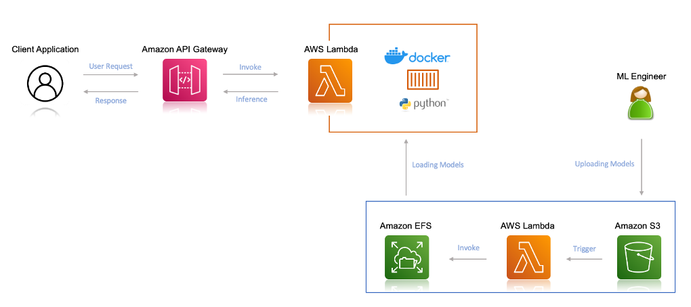
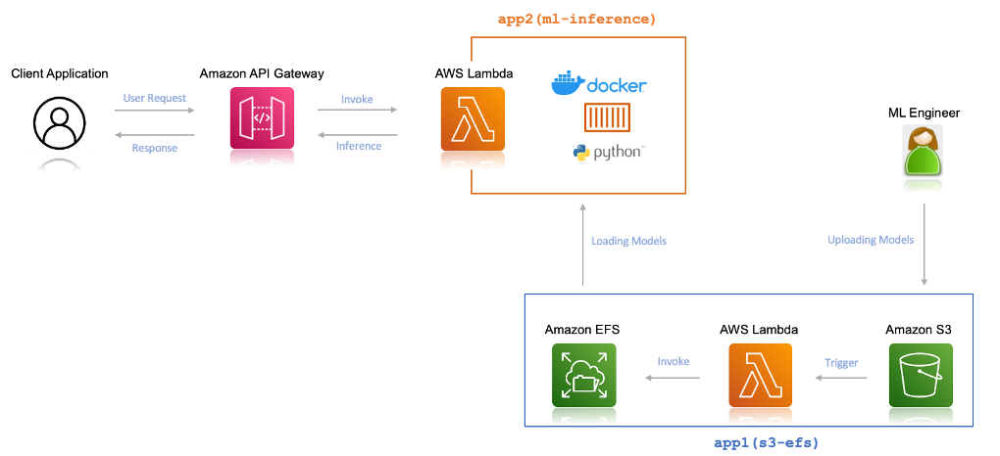
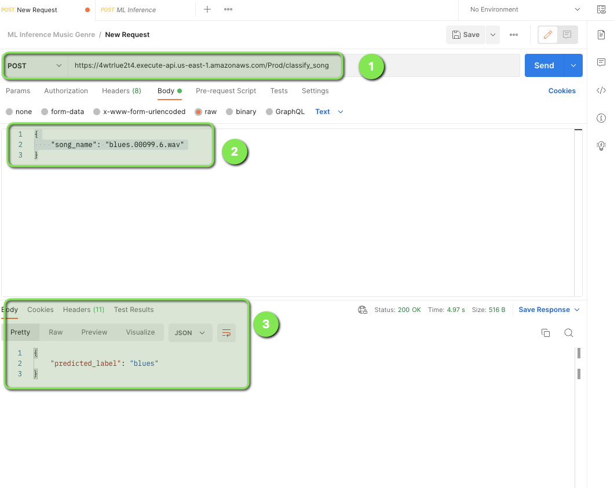

# Build and deploy a live, ML-powered music genre classifier

In this project, we will learn how to build a machine learning (ML) model to classify music genres using a dataset of songs. See how to deploy this model to a serverless inference and then make it an API endpoint. Finally, test the model with some live music in the session, where you get to decide what to play.


This repository is complementary to breakout session on "BOA322 - Build and deploy a live, ML-powered music genre classifier" at [re:Invent 2022](https://reinvent.awsevents.com/)

## Introduction 

In this repo, you will find all the code needed to build, train and deploy our ML-powered  music genre classifier using SageMaker and Lambda.

## Part 1 : ML Engineer/Data Scientist's Role 

In this section, you as a data scientist/ML engineer will train the ML model using k-NN or PyTorch. And once the model is trained, the model artifacts will be uploaded on Amazon S3 and that would be used by the Application Engineer in the downstream workflow of the application deployment. 

We are going to use the [GTZAN dataset](https://www.kaggle.com/datasets/andradaolteanu/gtzan-dataset-music-genre-classification?resource=download-directory) which is the most-used public dataset for evaluation in machine listening research for music genre recognition (MGR). 

The files were collected in 2000-2001 from a variety of sources including personal CDs, radio, microphone recordings, in order to represent a variety of recording conditions (http://marsyas.info/downloads/datasets.html).

The machine learning task is to predict the genre of the music. 

The dataset contains features of the audio files. One file has for each song (30 seconds long) a mean and variance computed over multiple features that can be extracted from an audio file. The other file has the same structure, but the songs were split before into 3 seconds audio files (this way increasing 10 times the amount of data we fuel into our classification models). With data, more is always better.


This notebook was tested in Amazon Notebook instance and Amazon SageMaker Studio on a ml.t3.medium instance with Python 3 (Data Science) kernel.


## Part 2 : Application Developer's Role

In this section, you as an application engineer will take the ML Model and build the application on AWS and will perform the inference. 

### Introduction 

In this repo, you will find all the code needed to deploy your application for Machine Learning Inference using AWS Lambda and Amazon EFS. 

### Application Workflow 

Here is the architectural work flow of our application:

- Create a serverless application which will __trigger__ a Lambda function upon a new model upload in your `S3 bucket`. And the function would copy that file from your S3 bucket to `EFS File System`

- Create another Lambda function that will load the model from `Amazon EFS` and performs the __prediction__ based on an image.

- Build and deploy both the application using  `AWS Serverless Application Model (AWS SAM)` application.

### Architecture 

To use the Amazon EFS file system from Lambda, you need the following:

- An Amazon __Virtual Private Cloud (Amazon VPC)__
- An __Amazon EFS__ file system created within that VPC with an access point as an application entry point for your __Lambda function__.
- A __Lambda function__ (in the same VPC and private subnets) referencing the access point.

The following diagram illustrates the solution architecture:



### Create an Amazon EFS file system, access point, and Lambda function

Now, we are going to use a single SAM deployment to deploy this, which will create the following two serverless applications, let’s call it :

- __app1(s3-efs)__: The serverless application which will transfer the uploaded ML models from your S3 bucket to the your EFS file system
- __app2(ml-inference)__: The serverless application which will perform the ML Inference from the client. 



### Steps to deploy 

1. Create a project directory:

```
$ mkdir my-ml-project
$ cd my-ml-project
```

2. Create a new serverless application in AWS SAM using the following command:

```
$ sam init
```

Choose Custom Template Location (`Choice`: `2`) as the template source, and provide the following GitHub template location:

https://github.com/debnsuma/boa322.git

3. Build the AWS SAM application

```
$ sam build --use-container
```

4. Deploy the application
```
$ sam deploy --guided
```
5. Provide a unique `Stack Name` and `SrcBucket` name 


7. Once the Application is deployed, keep a note of the API Gateway endpoint (we would need this at `Step 8` for inference)

6. Upload the ML model

```
$ aws s3 cp models.p s3://<THE BUCKET NAME YOU PROVIDED WHILE DEPLOYING THE SAM APPLICATION>
```

7. Perform ML inference : Use POSTMAN or API GW UI for inference, use the following in the body 

```
{
    "song_name": "blues.00099.6.wav" # Replace this with song of your choice
}
```
